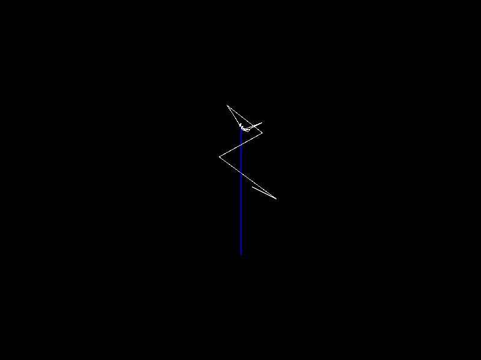

# Complex Fourier Series Visualisation

The goal of this project was to create a visualisation similar to that shown in [this video](https://www.youtube.com/watch?v=-qgreAUpPwM&vl=en), I was inspired by [this amazing video explaining all the maths](https://www.youtube.com/watch?v=r6sGWTCMz2k&vl=en) behind this visualisation.

Here is an example of it in action:

## Setup

This guide is for linux/WSL, so it may differ for Windows users.

1. Ensure you have Rust
2. Install the libsdl2 development libraries, for Ubuntu/WSL this would be `sudo apt install libsdl2-dev`
3. Clone the repository
4. If wanted, modify the `"example.svg"` to the path of whatever SVG you want in `src/lib.rs`
5. Run `cargo run` or `cargo run --release` (Latter option will take longer to build but should run a bit better)
6. Enjoy!

If you are using WSL, you may want to use an X server. I suggest [this stackoverflow answer](https://stackoverflow.com/a/61110604) (pay particular attention to the instructions about Windows Firewall), it's what I used.

## Controls

|Input                |Action                                         |
|---------------------|-----------------------------------------------|
|Click (hold) and drag|Moves view                                     |
|Scrollwheel          | Zooms in and out centred at the mouse         |
|R                    |Resets visualisation                           |
|-                    |Slows down visualisation (a bit buggy, press R)|
|=                    |Speeds up visualisation (a bit buggy, press R) |
|L                    |Locks camera to the drawing tip                |

## Potential improvements

- Fix speeding up/slowing down visualisation
- Fix weird bug where the drawn line falls behind where it should be drawn (press L and zoom in to see what I mean)
- Implement the maths for Elliptical Arcs
- Command line arguments for specifying what SVG, window size, etc.
- Resizable window
- Graphics acceleration? (would probably require a rewrite)
- Saving to gif/mp4
